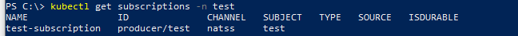

# Neuroglia.K8s.Eventing
An Open source .NET CORE 3.1 implementation of a cloud event gateway for Kubernetes and Istio

# Usage

## 1. Install the Kubernetes Custom Resource Definitions (CRDs)

```powershell
kubectl apply -f https://raw.githubusercontent.com/neuroglia-io/K8s.Eventing/main/deployment/eventing-crds.yaml
```

## 2. Install Neuroglia.K8s.Eventing on Kubernetes

```powershell
kubectl apply -f https://raw.githubusercontent.com/neuroglia-io/K8s.Eventing/main/deployment/eventing-core.yaml
```

Verify the installation by running the following command:

```powershell
kubectl get services -n neuroglia-eventing
```

If the installation was successfull, you should see a similar result:


## 3. Install an eventing channel

Available channels:
- NATS Streaming

### NATS Streaming Channel

#### Install NATS Streaming

```powershell
kubectl apply -f https://raw.githubusercontent.com/neuroglia-io/K8s.Eventing/main/deployment/natss.yaml
```

Verify NATS Streaming installation by running the following command:

```powershell
kubectl get services -n natss
```

If the installation was successfull, you should see a similar result:


#### Install NATS Streaming Channel

```powershell
kubectl apply -f https://raw.githubusercontent.com/neuroglia-io/K8s.Eventing/main/deployment/eventing-channel-natss.yaml
```

Verify NATS Streaming installation by running the following command:

```powershell
kubectl get channels -n neuroglia-eventing
```

If the installation was successfull, you should see a similar result:


## 4. Create a broker

### Create the broker's yaml file

```yaml
#broker.yaml

apiVersion: eventing.k8s.neuroglia.io/v1alpha1
kind: Broker
metadata:
  name: broker #the name of your broker. Can be anything you want.
  namespace: my-namespace #the namespace in which to install the broker
spec:
  channel: natss #the eventing channel to use
```

### Apply the broker

```powershell
kubectl apply -f broker.yaml
```

Verify that the broker was successfully installed:

```powershell
kubectl get brokers -n my-namespace
```

If the installation was successfull, you should see a similar result:


## 5. Start using Neuroglia Kubernetes Eventing

### Publishing a CloudEvent

Whenever one of your service needs to publish a CloudEvent, make an HTTP POST request to the 'pub' endpoint url of your namespaced broker, which is always equal to '**http://{brokerName}.{namespace}.svc.cluster.{clusterName}/events/pub**' (fully qualified service name) or '**http://{brokerName}/events/pub**' (namespaced service name).

If you are not sure about your broker's url, you can execute the following command:

```powershell
kubectl get brokers -n my-namespace
```

The broker's url will be displayed in the 'URL' column of the output.

```c#
using(HttpClient httpClient = new HttpClient())
{
    var content = new CloudEventContent(
        new CloudEvent("test", new Uri("/test", UriKind.Relative)) 
        { 
            Subject = "test", 
            Data = JsonConvert.SerializeObject(new { Message = "Hello world" }), 
            DataContentType = new ContentType(MediaTypeNames.Application.Json) 
        }, 
        ContentMode.Structured, 
        new JsonEventFormatter());
    using (HttpResponseMessage response = await httpClient.PostAsync("http://broker/events/pub", content))
    {
        response.EnsureSuccessStatusCode();
        this.Logger.LogInformation("Cloud event published");
    }
}
```

### Subscribing to CloudEvents

#### Declaratively

Create a new yaml file for your subscription:

```yaml
#sub.yaml

apiVersion: eventing.k8s.neuroglia.io/v1alpha1
kind: Subscription
metadata:
  name: test-subscription #The name of the subscription. Can be anything you want.
  namespace: my-namespace #The namespace the subscription belongs to.
spec:
  channel: natss #The channel the subscription is bound to
  subject: test #The subject to subscribe to
  subscriber:
    - uri: http://consumer.my-namespace.svc.cluster.local/events #The absolute uri to your consumer service's CloudEvent endpoint. It MUST have the following structure: http://{fullyQualifiedServiceName}/{cloudEventsEndpoint}
```

Apply your subscription

```powershell
kubectl apply -f sub.yaml
```

Verify that the subscription was successfully installed

```powershell
kubectl get subscriptions -n my-namespace
```

If the installation was successfull, you should see a similar result:



That's it! Start producing events and see them being dispatched to your service's endpoint.

#### Programatically

Whenever one of your service needs to create a new subscription programatically, make an HTTP POST request to the 'sub' endpoint url of your namespaced broker, which is always equal to '**http://{brokerName}.{namespace}.svc.cluster.{clusterName}/events/sub**' (fully qualified service name) or '**http://{brokerName}/events/sub**' (namespaced service name).

```C#
using (HttpClient httpClient = new HttpClient())
{
    var createSubscriptionCommand = new CreateSubscriptionCommandDto
    {
        Subject = "test",
        Channel = "natss",
        Subscribers = new List<Uri>()
        {
            new Uri($"http://my-consumer.my-namespace.svc.cluster.local")
        }
    };;
    using (HttpResponseMessage response = await httpClient.PostAsJsonAsync("http://broker/events/sub", options))
    {
        response.EnsureSuccessStatusCode();
        this.Logger.LogInformation("Subscription created");
    }
}
```

## Examples

There is an extensive example in the [examples directory](https://github.com/neuroglia-io/K8s.Eventing/tree/master/examples)

# Contributing

Please see [CONTRIBUTING.md](https://github.com/neuroglia-io/K8s.Eventing/blob/master/CONTRIBUTING.md) for instructions on how to contribute.
