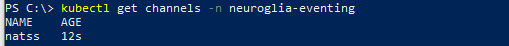

# Neuroglia.K8s.Eventing
An open source .NET CORE 3.1 implementation of a cloud event gateway for Kubernetes and Istio

* * *
**There is an issue with our Docker image registry, which is unavailable at the moment.**

**If you wish to test the solution, please clone the repository and build the following images locally before applying the [eventing-core.yaml](https://github.com/neuroglia-io/K8s.Eventing/blob/main/deployment/eventing-core.yaml) and [eventing-channel-natss.yaml](https://github.com/neuroglia-io/K8s.Eventing/blob/main/deployment/eventing-channel-natss.yaml) files:**
- [Gateway image](https://github.com/neuroglia-io/K8s.Eventing/blob/main/src/Gateway/Neuroglia.K8s.Eventing.Gateway.Api/Dockerfile)
- [NATSS Channel image](https://github.com/neuroglia-io/K8s.Eventing/blob/main/src/Channels/NATSS/Neuroglia.K8s.Eventing.Channels.Nats.Api/Dockerfile)
* * *

# Motivation

In the context of the development of our new cloud native POS Management solution, which heavily relies on integration events, we wanted to abstract away from our numerous microservices the burden of eventing-specific implementations, which were tightly coupled with vendor-specific code.

Furthermore, shortly after discovering and falling in love with Istio - which already abstracts a lot of concerns away from applications (ex: tracing, metrics, logging, ...) -, we decided we needed to be able to leverage the traffic shaping features of that beautiful software by applying it to eventing.

The problem with brokers such as NATS, RabbitMQ and Kafka is that events (messages) are usually transfered thanks to some kind of application layer on top of an opaque TCP connection, which makes it near impossible to shape traffic based on attributes such as message subject and would have tightly coupled whatever solution we may have come up with to vendor-specific implementations, thus taking away from us the freedom to change those at will, according to use cases.

We then found the CloudEvent specification... In short, the latter "is a specification for describing event data in common formats to provide interoperability across services, platforms and systems". Because they are best used in association with well-known communication technologies such as HTTP and/or GRPC, using CloudEvents made traffic shaping with Istio (or other meshes) theoretically possible, thus solving the problems described above. The only thing we were lacking to make it happen at that point was a gateway, meaning a software which could consume cloud events, optionally publishing them to underlying sinks such as NATS or Kafka, and would route them to subscribers.

Knative eventing and other similar solutions looked like they could do the trick. And in a way they did. As a matter of fact, those technologies did abstract away from our apps all the eventing technicalities, limiting their concern to the implementation of simple HTTP endpoints, while optionnally running on top of vendor-specific implementations in the backend. They did, however, come with huge pain points:
- Subscriptions/Triggers and the like could only be created declaratively, that is thanks to an applied yaml file on Kurbenetes. Rare are the use cases where it isn't enough, but they exist (autonomous replicas of a statefull service, for instance).
- Subscriptions were left to their bare minimum: there was no way to, say, create a durable subscription to a given subject, or to replay a whole stream of events in case of the critical failure of a service. In fact, I don't even understand why Knative, for example, relies on NATS Streaming rather than NATS, for it does not seem to leverage the persistence mechanisms it offers, at least not at a consumer level.

We then took the decision to use the incredible possibilities Kubernetes and Istio offer to make the CloudEvent Gateway that could solve all of our problems, in the most simple and unambitious way possible. 

This repository contains the result of our quest. We hope it can be as usefull to you as it has been to us.

Happy coding!

# Usage

## 1. Install the Custom Resource Definitions (CRDs)

```powershell
kubectl apply -f https://raw.githubusercontent.com/neuroglia-io/K8s.Eventing/main/deployment/eventing-crds.yaml
```

## 2. Deploy Neuroglia.K8s.Eventing

```powershell
kubectl apply -f https://raw.githubusercontent.com/neuroglia-io/K8s.Eventing/main/deployment/eventing-core.yaml
```

Verify the installation by running the following command:

```powershell
kubectl get services -n neuroglia-eventing
```

If the installation was successfull, you should see a similar result:


## 3. Install an eventing channel

Available channels:
- NATS Streaming

### NATS Streaming Channel

#### Install NATS Streaming

```powershell
kubectl apply -f https://raw.githubusercontent.com/neuroglia-io/K8s.Eventing/main/deployment/natss.yaml
```

Verify NATS Streaming installation by running the following command:

```powershell
kubectl get services -n natss
```

If the installation was successfull, you should see a similar result:


#### Install NATS Streaming Channel

```powershell
kubectl apply -f https://raw.githubusercontent.com/neuroglia-io/K8s.Eventing/main/deployment/eventing-channel-natss.yaml
```

Verify NATS Streaming installation by running the following command:

```powershell
kubectl get channels -n neuroglia-eventing
```

If the installation was successfull, you should see a similar result:



## 4. Create a broker

### Create the broker's yaml file

```yaml
#broker.yaml

apiVersion: eventing.k8s.neuroglia.io/v1alpha1
kind: Broker
metadata:
  name: broker #the name of your broker. Can be anything you want.
  namespace: my-namespace #the namespace in which to install the broker
spec:
  channel: natss #the eventing channel to use
```

### Apply the broker

```powershell
kubectl apply -f broker.yaml
```

Verify that the broker was successfully installed:

```powershell
kubectl get brokers -n my-namespace
```

If the installation was successfull, you should see a similar result:


## 5. Start using Neuroglia Kubernetes Eventing

### Publishing a CloudEvent

Whenever one of your service needs to publish a CloudEvent, make an HTTP POST request to the 'pub' endpoint url of your namespaced broker, which is always equal to '**http://{brokerName}.{namespace}.svc.cluster.{clusterName}/events/pub**' (fully qualified service name) or '**http://{brokerName}/events/pub**' (namespaced service name).

If you are not sure about your broker's url, you can execute the following command:

```powershell
kubectl get brokers -n my-namespace
```

The broker's url will be displayed in the 'URL' column of the output.

```c#
using(HttpClient httpClient = new HttpClient())
{
    var content = new CloudEventContent(
        new CloudEvent("test", new Uri("/test", UriKind.Relative)) 
        { 
            Subject = "test", 
            Data = JsonConvert.SerializeObject(new { Message = "Hello world" }), 
            DataContentType = new ContentType(MediaTypeNames.Application.Json) 
        }, 
        ContentMode.Structured, 
        new JsonEventFormatter());
    using (HttpResponseMessage response = await httpClient.PostAsync("http://broker/events/pub", content))
    {
        response.EnsureSuccessStatusCode();
        this.Logger.LogInformation("Cloud event published");
    }
}
```

### Subscribing to CloudEvents

#### Declaratively

Create a new yaml file for your subscription:

```yaml
#sub.yaml

apiVersion: eventing.k8s.neuroglia.io/v1alpha1
kind: Subscription
metadata:
  name: test-subscription #The name of the subscription. Can be anything you want.
  namespace: my-namespace #The namespace the subscription belongs to.
spec:
  channel: natss #The channel the subscription is bound to
  subject: test #The subject to subscribe to
  subscriber:
    - uri: http://consumer.my-namespace.svc.cluster.local/events #The absolute uri to your consumer service's CloudEvent endpoint. It MUST have the following structure: http://{fullyQualifiedServiceName}/{cloudEventsEndpoint}
```

Apply your subscription

```powershell
kubectl apply -f sub.yaml
```

Verify that the subscription was successfully installed

```powershell
kubectl get subscriptions -n my-namespace
```

If the installation was successfull, you should see a similar result:


That's it! Start producing events and see them being dispatched to your service's endpoint.

#### Programatically

Whenever one of your service needs to create a new subscription programatically, make an HTTP POST request to the 'sub' endpoint url of your namespaced broker, which is always equal to '**http://{brokerName}.{namespace}.svc.cluster.{clusterName}/events/sub**' (fully qualified service name) or '**http://{brokerName}/events/sub**' (namespaced service name).

```C#
using (HttpClient httpClient = new HttpClient())
{
    var createSubscriptionCommand = new CreateSubscriptionCommandDto
    {
        Subject = "test",
        Channel = "natss",
        Subscribers = new List<Uri>()
        {
            new Uri($"http://my-consumer.my-namespace.svc.cluster.local")
        }
    };;
    using (HttpResponseMessage response = await httpClient.PostAsJsonAsync("http://broker/events/sub", options))
    {
        response.EnsureSuccessStatusCode();
        this.Logger.LogInformation("Subscription created");
    }
}
```

## Examples

There is an extensive example in the [examples directory](https://github.com/neuroglia-io/K8s.Eventing/tree/master/examples)

### Running the example

### 1. Build the GatewayClient's docker image

```powershell
git clone git@github.com:neuroglia-io/K8s.Eventing.git
docker build -f "{localPath}\neuroglia.k8s.eventing\examples\gatewayclient\dockerfile" "{localPath}\neuroglia.k8s.eventing"
```

### 2. Deploy the GatewayClient to Kubernetes

```powershell
kubectl apply -f "{localPath}\neuroglia.k8s.eventing\examples\gatewayclient\eventing-test.yaml"
```

### 3. Verify that the GatewayClient's pod is running

```powershell
kubectl get pods -n eventing-test
```

### 4. Start testing

#### Creating a new subscription:

Make a POST request to 'http://localhost/events/sub?subject=MySubject'. 

Keep the returned subscription's id if you wish to delete it afterwards.

#### Deleting an existing subscription:

Make a DELETE request to 'http://localhost/events/unsub?subscriptionId=MySubscriptionId'

#### Publishing a new cloud event:

Make a POST request to 'http://localhost/events/pub' with an **'application/cloudevents+json'** payload such as the following:

```json
{
    "type": "io.neuroglia.test",
    "source": "/test",
    "subject": "test",
    "id": "testid",
    "data": "{ \"message\": \"hello world\"",
    "datacontentype": "application/json"
}
```

#### Verifying that all is working as expected:

Get the name of the pod the GatewayClient is running on:

```powershell
kubectl get pods -n eventing-test
```

Display the logs of the GatewayClient pod:

```powershell
kubectl logs -f {myPodId} -n eventing-test gatewayclient
```

You should see a log line such as **'Received a cloud event with type '{type}' and subject '{subject}''** every time you publish a new cloud event with a subject you have subscribed to.
If you delete the subscription, you should not receive any cloud events anymore.

### Cleaning up

```powershell
kubectl delete -f "{localPath}\neuroglia.k8s.eventing\examples\gatewayclient\eventing-test.yaml"
```

# Contributing

Please see [CONTRIBUTING.md](https://github.com/neuroglia-io/K8s.Eventing/blob/master/CONTRIBUTING.md) for instructions on how to contribute.
